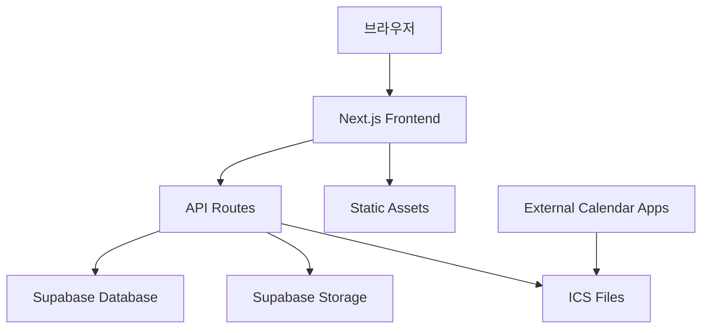

# KATUSA Calendar 개발자 가이드

이 문서는 KATUSA Calendar 프로젝트의 개발자를 위한 상세한 가이드입니다. 프로젝트의 철학, 아키텍처, 그리고 개발 과정에서 필요한 모든 정보를 담고 있습니다.

## 목차

- [프로젝트 철학 및 아키텍처](#프로젝트-철학-및-아키텍처)
- [폴더 구조 상세 설명](#폴더-구조-상세-설명)
- [API 레퍼런스](#api-레퍼런스)
- [컴포넌트 아키텍처](#컴포넌트-아키텍처)
- [데이터베이스 설계](#데이터베이스-설계)
- [인증 시스템](#인증-시스템)
- [테마 시스템](#테마-시스템)
- [개발 환경 설정](#개발-환경-설정)
- [배포 가이드](#배포-가이드)
- [트러블슈팅](#트러블슈팅)

## 프로젝트 철학 및 아키텍처

### 설계 철학

1. **모듈화 (Modularity)**: 각 기능은 독립적인 모듈로 분리하여 유지보수성을 높입니다.
2. **재사용성 (Reusability)**: 컴포넌트와 유틸리티 함수는 재사용 가능하도록 설계됩니다.
3. **확장성 (Scalability)**: 새로운 기능 추가 시 기존 구조를 크게 변경하지 않고도 확장 가능합니다.
4. **타입 안전성 (Type Safety)**: TypeScript를 점진적으로 도입하여 런타임 오류를 줄입니다.
5. **성능 최적화**: Next.js의 최적화 기능을 최대한 활용합니다.

### 아키텍처 개요



### 핵심 기술 선택 이유

- **Next.js**: SSR, SSG, API Routes를 통한 풀스택 개발 가능
- **Supabase**: PostgreSQL 기반의 실시간 데이터베이스와 인증 시스템
- **Tailwind CSS**: 유틸리티 우선 CSS 프레임워크로 빠른 UI 개발
- **shadcn/ui**: 일관된 디자인 시스템과 접근성을 고려한 컴포넌트

## 폴더 구조 상세 설명

### `/app` 디렉토리 (Next.js App Router)

```
app/
├── (auth)/                 # 인증 관련 라우트 그룹
├── admin/                  # 관리자 페이지
│   ├── layout.jsx         # 관리자 레이아웃
│   ├── page.jsx          # 관리자 대시보드
│   ├── calendar-input/   # 일정 입력 페이지
│   ├── inquiries/        # 문의 관리 페이지
│   ├── login/            # 관리자 로그인
│   ├── settings/         # 설정 페이지
│   ├── trash/            # 삭제된 항목 관리
│   └── users/            # 사용자 관리
├── api/                   # API 엔드포인트
│   ├── admin/            # 관리자 API
│   │   ├── login/        # 로그인 API
│   │   ├── logout/       # 로그아웃 API
│   │   └── users/        # 사용자 관리 API
│   ├── calendar/         # 캘린더 관련 API
│   │   └── [filename]/   # 동적 캘린더 파일 제공
│   └── generate-ics/     # ICS 파일 생성 API
├── calendar/              # 공개 캘린더 뷰
├── contact/               # 문의 페이지
├── globals.css            # 전역 CSS
├── layout.jsx            # 루트 레이아웃
└── page.jsx              # 홈페이지
```

### `/components` 디렉토리 (Atomic Design 패턴)

```
components/
├── atoms/                 # 원자 컴포넌트 (최소 단위)
│   ├── Button/           # 버튼 컴포넌트들
│   ├── Display/          # 표시 관련 컴포넌트
│   ├── Feedback/         # 피드백 컴포넌트 (알림, 토스트 등)
│   ├── Form/             # 폼 관련 기본 컴포넌트
│   ├── Input/            # 입력 컴포넌트들
│   └── Navigation/       # 네비게이션 기본 요소
├── molecules/            # 분자 컴포넌트 (원자들의 조합)
│   ├── Cards/            # 카드 형태의 컴포넌트
│   ├── Controls/         # 제어 관련 컴포넌트
│   ├── Forms/            # 복합 폼 컴포넌트
│   ├── Layout/           # 레이아웃 관련 분자 컴포넌트
│   ├── Navigation/       # 복합 네비게이션
│   ├── Overlays/         # 오버레이 컴포넌트
│   └── Tables/           # 테이블 관련 컴포넌트
├── organisms/            # 유기체 컴포넌트 (복잡한 UI 섹션)
│   ├── Admin/            # 관리자 관련 복합 컴포넌트
│   ├── Calendar/         # 캘린더 관련 복합 컴포넌트
│   ├── Forms/            # 복잡한 폼 컴포넌트
│   ├── Interactive/      # 인터랙티브 컴포넌트
│   ├── Layout/           # 레이아웃 유기체
│   └── Sections/         # 페이지 섹션 컴포넌트
├── overlays/             # 오버레이 컴포넌트들
├── providers/            # React Context 제공자
├── templates/            # 템플릿 컴포넌트
│   ├── AdminLayout/      # 관리자 레이아웃 템플릿
│   └── PublicLayout/     # 공개 페이지 레이아웃 템플릿
```

### `/lib` 디렉토리 (유틸리티 및 서비스)

```
lib/
├── api/                   # API 관련 유틸리티
│   ├── auth.js           # 인증 관련 함수
│   └── supabase/         # Supabase 관련 설정
│       ├── admin.js      # Supabase 관리자 클라이언트
│       ├── client.js     # Supabase 클라이언트
│       ├── server.js     # Supabase 서버 클라이언트
│       ├── storage.js    # 스토리지 관련 함수
│       └── helpers/      # 도메인별 헬퍼 함수
├── constants/            # 상수 정의
├── generators/           # 파일 생성 관련
│   └── ics.js           # ICS 파일 생성기
├── hooks/                # 커스텀 React 훅
├── services/             # 비즈니스 로직
├── theme/                # 테마 관련 설정
└── utils/                # 범용 유틸리티 함수
```

## API 레퍼런스

### 관리자 API

#### POST `/api/admin/login`
관리자 로그인을 처리합니다.

**요청 본문:**
```json
{
  "username": "string",
  "password": "string"
}
```

**응답:**
```json
{
  "success": true,
  "token": "jwt_token",
  "user": {
    "id": "string",
    "username": "string",
    "nickname": "string",
    "role": "admin"
  }
}
```

#### POST `/api/admin/logout`
관리자 로그아웃을 처리합니다.

**헤더:**
```
Authorization: Bearer <token>
```

**응답:**
```json
{
  "success": true,
  "message": "로그아웃되었습니다."
}
```

#### GET/POST/PUT/DELETE `/api/admin/users`
사용자 관리 API입니다.

**GET** - 사용자 목록 조회
```json
{
  "users": [
    {
      "id": "string",
      "username": "string",
      "nickname": "string",
      "email": "string",
      "role": "user|admin",
      "created_at": "datetime"
    }
  ]
}
```

### 캘린더 API

#### GET `/api/calendar/[filename]`
특정 캘린더의 ICS 파일을 제공합니다.

**파라미터:**
- `filename`: 캘린더 파일명 (예: `katusa-general.ics`)

**응답:**
```
Content-Type: text/calendar
Content-Disposition: inline; filename="katusa-general.ics"

BEGIN:VCALENDAR
VERSION:2.0
PRODID:-//KATUSA Calendar//EN
...
END:VCALENDAR
```

#### GET `/api/generate-ics`
모든 캘린더의 ICS 파일을 생성하고 업데이트합니다. (CRON 작업용)

**헤더:**
```
Authorization: Bearer <CRON_SECRET>
```

**응답:**
```json
{
  "success": true,
  "results": [
    {
      "calendar": "katusa-general",
      "status": "success",
      "filename": "katusa-general.ics"
    }
  ]
}
```

## 컴포넌트 아키텍처

### Atomic Design 패턴 적용

본 프로젝트는 Brad Frost의 Atomic Design 패턴을 따릅니다:

1. **Atoms (원자)**: 버튼, 입력 필드, 레이블 등 더 이상 분해할 수 없는 기본 UI 요소
2. **Molecules (분자)**: 원자들을 조합한 단순한 UI 컴포넌트 (검색 폼, 카드 등)
3. **Organisms (유기체)**: 분자와 원자로 구성된 복잡한 UI 컴포넌트 (헤더, 사이드바 등)
4. **Templates (템플릿)**: 페이지의 레이아웃을 정의하는 와이어프레임
5. **Pages (페이지)**: 실제 콘텐츠가 채워진 템플릿의 인스턴스

### 컴포넌트 네이밍 규칙

- **파일명**: PascalCase (예: `UserProfile.tsx`)
- **폴더명**: PascalCase (예: `UserProfile/`)
- **컴포넌트명**: PascalCase (예: `UserProfile`)
- **Props**: camelCase (예: `userName`, `isActive`)

### 컴포넌트 구조 예시

```typescript
// components/atoms/Button/button.tsx
interface ButtonProps {
  variant?: 'default' | 'destructive' | 'outline' | 'secondary' | 'ghost' | 'link'
  size?: 'default' | 'sm' | 'lg' | 'icon'
  children: React.ReactNode
  onClick?: () => void
  disabled?: boolean
}

export const Button: React.FC<ButtonProps> = ({
  variant = 'default',
  size = 'default',
  children,
  onClick,
  disabled = false,
  ...props
}) => {
  return (
    <button
      className={cn(buttonVariants({ variant, size }))}
      onClick={onClick}
      disabled={disabled}
      {...props}
    >
      {children}
    </button>
  )
}
```

## 데이터베이스 설계

### 주요 테이블 구조

#### `calendars` 테이블
```sql
CREATE TABLE calendars (
  id UUID PRIMARY KEY DEFAULT gen_random_uuid(),
  type VARCHAR(50) NOT NULL,
  title VARCHAR(255) NOT NULL,
  description TEXT,
  filename VARCHAR(255) UNIQUE NOT NULL,
  is_active BOOLEAN DEFAULT true,
  created_at TIMESTAMP WITH TIME ZONE DEFAULT NOW(),
  updated_at TIMESTAMP WITH TIME ZONE DEFAULT NOW()
);
```

#### `events` 테이블
```sql
CREATE TABLE events (
  id UUID PRIMARY KEY DEFAULT gen_random_uuid(),
  calendar_id UUID REFERENCES calendars(id),
  title VARCHAR(255) NOT NULL,
  description TEXT,
  start_date DATE NOT NULL,
  end_date DATE NOT NULL,
  is_all_day BOOLEAN DEFAULT true,
  location VARCHAR(255),
  status VARCHAR(20) DEFAULT 'active',
  created_by UUID,
  created_at TIMESTAMP WITH TIME ZONE DEFAULT NOW(),
  updated_at TIMESTAMP WITH TIME ZONE DEFAULT NOW()
);
```

#### `users` 테이블
```sql
CREATE TABLE users (
  id UUID PRIMARY KEY DEFAULT gen_random_uuid(),
  username VARCHAR(50) UNIQUE NOT NULL,
  password_hash VARCHAR(255) NOT NULL,
  nickname VARCHAR(100),
  email VARCHAR(255) UNIQUE,
  role VARCHAR(20) DEFAULT 'user',
  is_active BOOLEAN DEFAULT true,
  last_login TIMESTAMP WITH TIME ZONE,
  created_at TIMESTAMP WITH TIME ZONE DEFAULT NOW(),
  updated_at TIMESTAMP WITH TIME ZONE DEFAULT NOW()
);
```

#### `inquiries` 테이블
```sql
CREATE TABLE inquiries (
  id UUID PRIMARY KEY DEFAULT gen_random_uuid(),
  name VARCHAR(100) NOT NULL,
  email VARCHAR(255) NOT NULL,
  subject VARCHAR(255) NOT NULL,
  type VARCHAR(50) NOT NULL,
  message TEXT NOT NULL,
  status VARCHAR(20) DEFAULT 'pending',
  response TEXT,
  responded_by UUID REFERENCES users(id),
  responded_at TIMESTAMP WITH TIME ZONE,
  created_at TIMESTAMP WITH TIME ZONE DEFAULT NOW()
);
```

### Supabase 설정

#### Row Level Security (RLS) 정책

```sql
-- 캘린더는 모든 사용자가 읽기 가능
CREATE POLICY "공개 캘린더 읽기" ON calendars
  FOR SELECT TO anon, authenticated
  USING (is_active = true);

-- 이벤트는 모든 사용자가 읽기 가능
CREATE POLICY "공개 이벤트 읽기" ON events
  FOR SELECT TO anon, authenticated
  USING (status = 'active');

-- 관리자만 데이터 수정 가능
CREATE POLICY "관리자만 수정" ON events
  FOR ALL TO authenticated
  USING (auth.jwt() ->> 'role' = 'admin');
```

## 인증 시스템

### JWT 기반 인증

프로젝트는 커스텀 JWT 인증 시스템을 사용합니다.

#### 인증 플로우

1. **로그인**: 사용자명/비밀번호로 로그인
2. **토큰 생성**: JWT 토큰 생성 및 쿠키에 저장
3. **토큰 검증**: 각 요청마다 토큰 유효성 검사
4. **자동 갱신**: 토큰 만료 전 자동 갱신

#### 보안 고려사항

- 비밀번호는 bcrypt로 해시화
- JWT 토큰은 httpOnly 쿠키에 저장
- CSRF 방지를 위한 토큰 검증
- 세션 타임아웃 설정

## 테마 시스템

### CSS 변수 기반 테마

프로젝트는 CSS 변수를 사용한 다크/라이트 테마를 지원합니다.

#### 테마 설정 파일

```css
/* globals.css */
@layer base {
  :root {
    --background: 0 0% 100%;
    --foreground: 222.2 84% 4.9%;
    --primary: 222.2 47.4% 11.2%;
    --primary-foreground: 210 40% 98%;
    /* ... */
  }

  .dark {
    --background: 222.2 84% 4.9%;
    --foreground: 210 40% 98%;
    --primary: 210 40% 98%;
    --primary-foreground: 222.2 47.4% 11.2%;
    /* ... */
  }
}
```

#### ThemeProvider 사용

```typescript
// components/providers/theme-provider.tsx
import { useTheme } from 'next-themes'

export function ThemeProvider({ children }) {
  return (
    <NextThemesProvider
      attribute="class"
      defaultTheme="system"
      enableSystem
      disableTransitionOnChange
    >
      {children}
    </NextThemesProvider>
  )
}
```

## 개발 환경 설정

### 필수 도구

- Node.js 18 이상
- pnpm (패키지 매니저)
- VS Code (권장 에디터)
- Git

### VS Code 확장

권장하는 VS Code 확장:

```json
{
  "recommendations": [
    "bradlc.vscode-tailwindcss",
    "ms-vscode.vscode-typescript-next",
    "esbenp.prettier-vscode",
    "ms-vscode.vscode-eslint",
    "formulahendry.auto-rename-tag"
  ]
}
```

### 환경변수 설정

```bash
# .env.local
NEXT_PUBLIC_SUPABASE_URL=your_supabase_url
NEXT_PUBLIC_SUPABASE_ANON_KEY=your_supabase_anon_key
SUPABASE_SERVICE_ROLE_KEY=your_service_role_key
SUPABASE_JWT_SECRET=your_jwt_secret
ADMIN_JWT_SECRET=your_admin_jwt_secret
ADMIN_PASSWORD_SALT=your_password_salt
CRON_SECRET=your_cron_secret
NEXT_PUBLIC_CRON_SECRET=your_cron_secret
```

### 로컬 개발 서버 실행

```bash
# 의존성 설치
pnpm install

# 개발 서버 시작
pnpm dev

# 빌드
pnpm build

# 프로덕션 서버 시작
pnpm start
```

## 배포 가이드

### Vercel 배포

1. **GitHub 연동**: Vercel과 GitHub 저장소 연결
2. **환경변수 설정**: Vercel 대시보드에서 환경변수 설정
3. **빌드 설정**: `vercel.json` 파일로 빌드 설정 관리
4. **자동 배포**: main 브랜치 푸시 시 자동 배포

### Supabase 설정

1. **프로젝트 생성**: Supabase에서 새 프로젝트 생성
2. **데이터베이스 스키마**: SQL 스크립트로 테이블 생성
3. **RLS 정책**: Row Level Security 정책 설정
4. **Storage 설정**: ICS 파일 저장을 위한 버킷 생성

### CRON 작업 설정

Vercel Cron Jobs를 사용하여 정기적으로 ICS 파일을 업데이트:

```json
{
  "crons": [
    {
      "path": "/api/generate-ics",
      "schedule": "0 */6 * * *"
    }
  ]
}
```

## 트러블슈팅

### 자주 발생하는 문제

#### 1. Hydration 불일치

**문제**: 서버와 클라이언트 렌더링 결과가 다름
**해결**: `useEffect`와 `mounted` 상태로 클라이언트 전용 렌더링

```typescript
const [mounted, setMounted] = useState(false)

useEffect(() => {
  setMounted(true)
}, [])

if (!mounted) return null
```

#### 2. Supabase 연결 오류

**문제**: 환경변수 설정 오류
**해결**: `.env.local` 파일 확인 및 Supabase URL/키 검증

#### 3. Next.js 빌드 오류

**문제**: TypeScript 타입 오류
**해결**: `next.config.mjs`에서 TypeScript 엄격 모드 조정

```javascript
/** @type {import('next').NextConfig} */
const nextConfig = {
  typescript: {
    ignoreBuildErrors: false
  }
}
```

#### 4. 테마 전환 오류

**문제**: 테마 전환 시 깜빡임
**해결**: `next-themes`의 `disableTransitionOnChange` 옵션 사용

### 성능 최적화

1. **이미지 최적화**: Next.js Image 컴포넌트 사용
2. **코드 분할**: 동적 import로 번들 크기 최적화
3. **캐싱**: SWR 또는 React Query로 데이터 캐싱
4. **Lighthouse 점수**: 정기적인 성능 측정 및 개선

### 디버깅 도구

- React Developer Tools
- Next.js DevTools
- Supabase 대시보드
- Vercel Analytics
- Chrome DevTools

---

이 문서는 프로젝트 발전에 따라 지속적으로 업데이트됩니다. 궁금한 점이나 개선사항이 있다면 이슈를 등록해 주세요.
